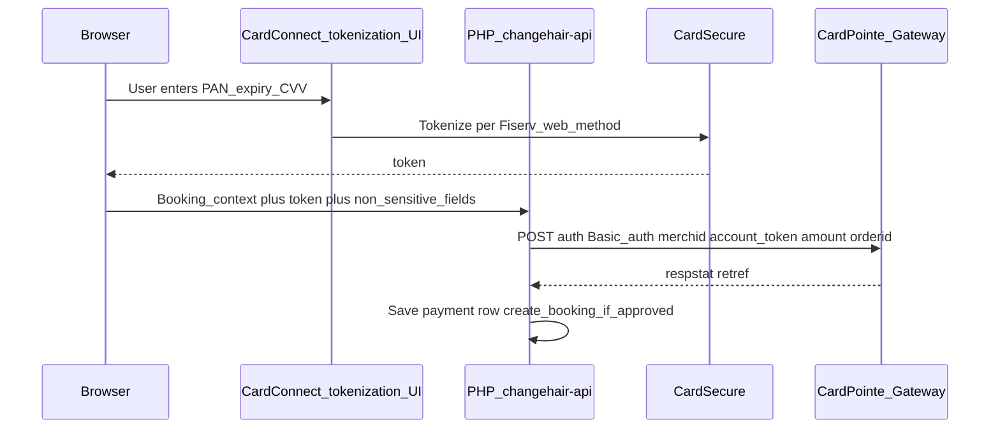

# CardConnect credit card booking deposit (wallets deferred)

## Scope change

- **In scope:** Card-not-present **credit card** payment for the existing **booking deposit** flow; **Apple Pay and Google Pay are explicitly out of scope** for this phase (no merchant session endpoint, no wallet payloads, no `EC_APPLE_PAY` / `EC_GOOGLE_PAY`).
- **Still use:** [CardPointeGatewayAPI.yaml](file:///Users/paulcui/Downloads/card-pointe%202/1.0.0/CardPointeGatewayAPI/CardPointeGatewayAPI.yaml) `POST /cardconnect/rest/auth` with `account` = **CardSecure token**, `merchid`, `amount`, unique `orderid`, `capture` as needed, plus `ecomind` / `postal` / AVS fields per your MID rules.
- **Token source:** [CardSecureAPI.yaml](file:///Users/paulcui/Downloads/card-pointe%202/1.0.0/CardSecureAPI/CardSecureAPI.yaml) `POST /cardsecure/api/v1/ccn/tokenize` using the **manual card** path (`account` + `expiry`, optional `cvv` per docs/examples—not the wallet `devicedata` path).

## PCI and “credit card form” shape

Two implementation tiers; pick based on compliance comfort and what Fiserv enables on your site:

1. **Recommended (narrower PCI scope):** Use **Fiserv/CardConnect documented web tokenization** (e.g. hosted iframe / CardPointe.js-style flow, per their integration guide) so the **browser** sends the PAN to **CardSecure** (or a CardConnect-controlled field) and your app receives only a **token**. Your React “form” is either embedded fields from their SDK or styled wrappers; your PHP never logs or stores PAN/CVV.
2. **Not recommended:** Plain `<input>` card number posted to `[changehair-api](changehair-api)` → PHP calls tokenize. That makes **your server** handle CHD and typically drives a **much heavier SAQ** (often SAQ D). Only consider if explicitly required and approved by your QSA/acquirer.

The plan below assumes **tier 1** as the target; if their docs only support server-side tokenize for your boarding, call that out during implementation and treat compliance as a blocker.

## Backend (`[changehair-api](changehair-api)`)

- **Environment:** `CARDCONNECT_BASE_URL`, `CARDCONNECT_MERCHID`, `CARDCONNECT_API_USER`, `CARDCONNECT_API_PASSWORD`, deposit amount or pricing rules; no Apple/Google vars.
- **PHP CardConnect client:** HTTP client for Gateway `auth` (Basic). Optionally **server-side** `tokenize` only if tier 2 or if Fiserv requires a server hop—confirm in their web integration doc.
- **New endpoint(s):**
  - **Charge + book:** e.g. `POST /api/client/booking-pay.php` (or extend `[bookings.php](changehair-api/public/api/client/bookings.php)` with a guarded path): validate slot/services/guest same as today, accept **token** + **amount** + billing fields (`postal`, name) if required, call **auth** with unique `orderid`, on `respstat === "A"` call existing `create_booking` and persist payment metadata (`retref`, `orderid`, amount, timestamp). **Do not** accept raw PAN from the client in the recommended design.
- **Database:** migration for `payments` / `booking_payments` and optional `bookings.payment_status` (same intent as prior wallet plan, without wallet-specific columns).

## Frontend (`[src/pages/BookingPage.tsx](src/pages/BookingPage.tsx)`)

- Add a **payment step** between **review** and **success** (or fold into review): show **deposit total** and integrate **CardConnect’s web tokenization** per their documentation (script URL, site/MID parameters they specify).
- On success, POST **token** + booking payload to your PHP charge endpoint; keep existing success UX.
- **No** Apple Pay / Google Pay buttons or scripts in this phase.

## Testing and go-live

- UAT base URL from YAML (`site-uat.cardconnect.com`) until production host is confirmed.
- Use Fiserv test cards; verify `inquireMerchant` for your MID.
- Later phase: add wallets by reusing the same **auth** path after CardSecure wallet tokenize.

## Explicitly deferred

- Apple Pay merchant validation, domain association, Apple certificates.
- Google Pay API / Business Console gateway config.
- `[CardPointeIntegratedTerminalAPI.yaml](file:///Users/paulcui/Downloads/card-pointe%202/1.0.0/CardPointeIntegratedTerminalAPI/CardPointeIntegratedTerminalAPI.yaml)` and `[CardAccountUpdaterAPI.yaml](file:///Users/paulcui/Downloads/card-pointe%202/1.0.0/CardAccountUpdaterAPI/CardAccountUpdaterAPI.yaml)` unless you add stored cards later.

